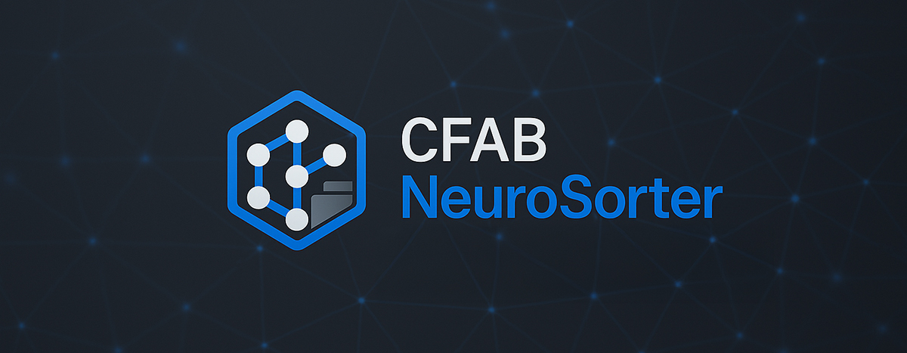
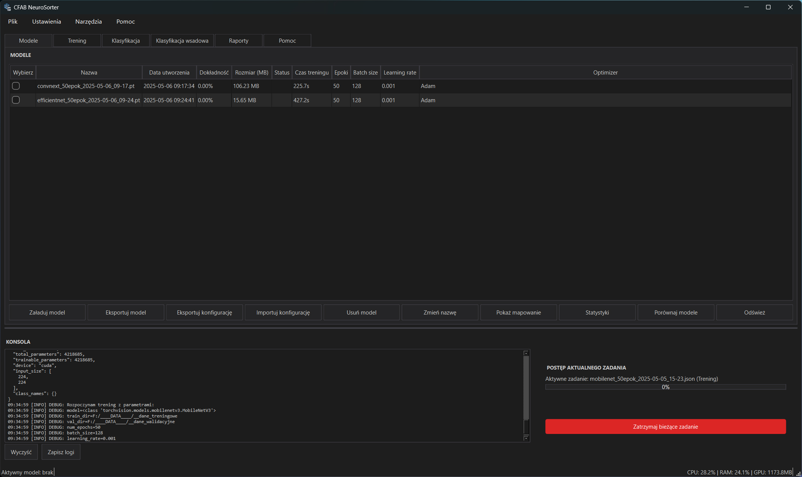
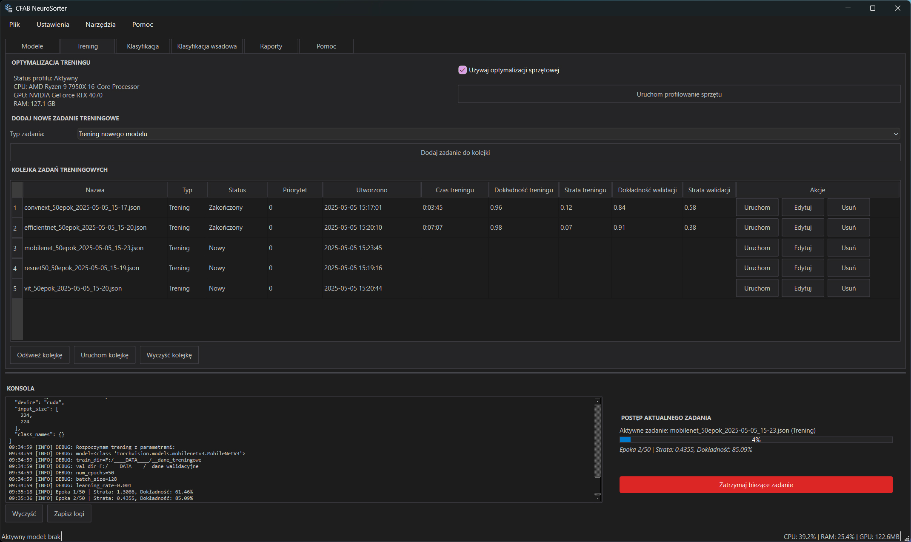
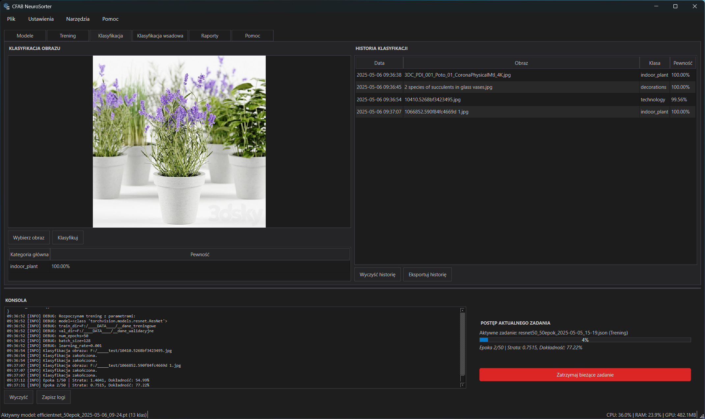
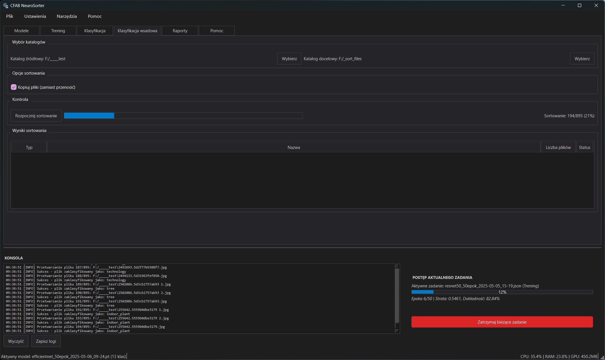
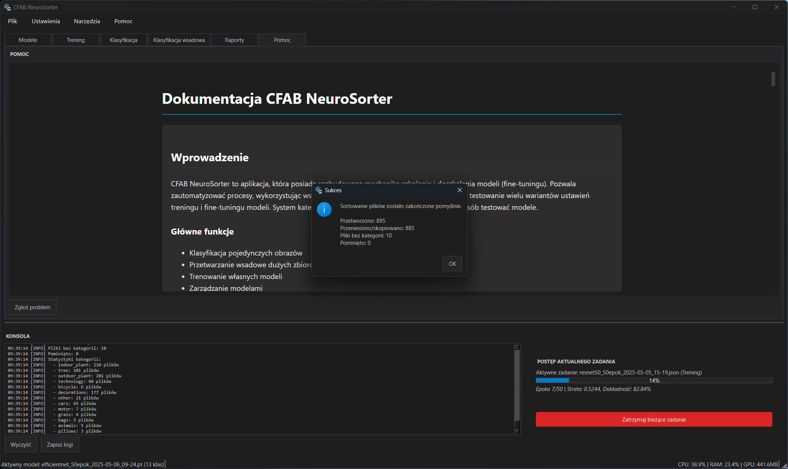

# CFAB NeuroSorter



## Opis projektu

CFAB NeuroSorter to aplikacja, która posiada rozbudowaną mechanikę szkolenia i doszkalania modeli (fine-tuningu). Pozwala zautomatyzować procesy, wykorzystując wsadowe przetwarzanie zadań. Umożliwia wydajne testowanie wielu wariantów ustawień treningu i fine-tuningu modeli. System kategoryzowania obrazów pozwala w efektywny sposób testować modele.

## Jak to działa

1. Użytkownik wybiera katalog zawierający zdjęcia
2. Aplikacja analizuje wszystkie obrazy w katalogu
3. Dla każdego obrazu:
   - Określa kategorię na podstawie zawartości
   - Dodaje metadane do pliku
   - Zapisuje informacje w bazie danych
4. Opcjonalnie sortuje pliki do odpowiednich katalogów według kategorii

## Funkcjonalności

- Automatyczna klasyfikacja obrazów w wybranym katalogu
- Dodawanie metadanych o kategorii do plików obrazów
- Interfejs graficzny do zarządzania procesem klasyfikacji
- Możliwość trenowania i dostrajania własnych modeli klasyfikacji
- Historia klasyfikacji w bazie danych
- Sortowanie plików do katalogów według kategorii (kopiowanie lub przenoszenie)
- Wsparcie dla obliczeń na GPU (CUDA) z automatycznym wykrywaniem
- Generowanie raportów z klasyfikacji w różnych formatach
- Zaawansowane opcje augmentacji danych podczas trenowania modeli
- Wsadowe przetwarzanie dużych kolekcji obrazów
- Obsługa z linii poleceń (skrypt sorter.py)
- Pamięć podręczna dla zwiększenia wydajności
- Ciemny motyw interfejsu
- Profiler sprzętowy do optymalizacji wydajności
- Wskaźnik postępu dla długotrwałych operacji
- Zarządzanie historią klasyfikacji i raportami
- Wsadowy trening i doszkalanie modeli
- Automatyczna optymalizacja parametrów treningu
- Eksport modeli do formatu ONNX

## Modele klasyfikacji

Aplikacja oferuje kilka zaawansowanych architektur sieci neuronowych do wyboru, każda z nich jest wstępnie trenowana na zbiorze danych ImageNet:

### ResNet50 (domyślny)

- Głęboka sieć rezydualna o 50 warstwach
- Zbalansowana wydajność i dokładność
- Dobrze sprawdza się na różnorodnych zbiorach danych
- Relatywnie niskie zużycie pamięci w porównaniu do wydajności
- Domyślny wybór dla większości zastosowań

### EfficientNet B0

- Lekka i wydajna architektura zaprojektowana do optymalizacji dokładności przy ograniczonych zasobach
- Wykorzystuje techniki skalowania złożonego (compound scaling)
- Mniejsze zużycie pamięci i szybsza inferecja niż ResNet50
- Idealna do urządzeń z ograniczonymi zasobami

### MobileNet V3 Large

- Zoptymalizowana do pracy na urządzeniach mobilnych
- Bardzo szybka inferecja przy zachowaniu dobrej dokładności
- Najniższe zużycie pamięci spośród wszystkich dostępnych modeli
- Zalecana do aplikacji działających w czasie rzeczywistym

### Vision Transformer (ViT)

- Nowoczesna architektura oparta na mechanizmie uwagi (attention)
- Doskonale radzi sobie ze złożonymi wzorcami i zależnościami przestrzennymi
- Wysoka dokładność na zróżnicowanych danych
- Większe zużycie zasobów, ale często lepsze wyniki na trudnych zbiorach danych

### ConvNeXt Tiny

- Hybryda między klasycznymi sieciami konwolucyjnymi a transformerami
- Nowoczesny design z wydajnością ViT przy niższym zużyciu zasobów
- Dobry kompromis między wydajnością a dokładnością
- Sprawdza się dobrze na zbiorach danych wymagających rozpoznawania szczegółów

Każdy model może być:

- Trenowany od podstaw na własnym zbiorze danych
- Dostrajany (fine-tuning) jeśli model bazowy już istnieje
<!-- - Eksportowany do formatu ONNX dla wykorzystania w innych aplikacjach -->
- Skompresowany lub zoptymalizowany do szybszej inferecji

Aplikacja automatycznie wykrywa dostępność CUDA i odpowiednio optymalizuje modele do obliczeń na GPU, włączając automatyczny wybór precyzji (full/half) i rozmiaru wsadu (batch size).

## Wymagania systemowe

- Python 3.8 lub nowszy
- Biblioteki wymienione w pliku requirements.txt
- Opcjonalnie: karta graficzna NVIDIA z obsługą CUDA dla przyspieszenia obliczeń

## Instalacja

1. Sklonuj repozytorium
2. Zainstaluj wymagane zależności:

```bash
pip install -r requirements.txt
```

## Struktura projektu

- `cfabNS.py` - główny plik uruchomieniowy aplikacji z interfejsem graficznym
- `data_splitter_gui.py` - narzędzie do podziału zbiorów danych
- `settings.json` - plik konfiguracyjny aplikacji
- `requirements.txt` - lista zależności projektu
- `app/` - moduł zawierający interfejs użytkownika i logikę aplikacji
  - `gui/` - interfejs użytkownika
    - `main_window.py` - główne okno aplikacji
    - `widgets.py` - komponenty interfejsu
  - `database/` - obsługa bazy danych
    - `db_manager.py` - zarządzanie bazą danych SQLite
    - `query_builder.py` - narzędzie do budowania zapytań SQL
  - `metadata/` - zarządzanie metadanymi plików
    - `metadata_manager.py` - dodawanie i odczytywanie metadanych EXIF
  - `sorter/` - funkcje sortowania obrazów
    - `image_sorter.py` - główna klasa do sortowania obrazów
  - `utils/` - narzędzia pomocnicze
    - `file_utils.py` - operacje na plikach
    - `image_utils.py` - przetwarzanie obrazów
    - `profiler.py` - profiler wydajności sprzętowej
  - `core/` - główne komponenty aplikacji
    - `batch_processor.py` - przetwarzanie wsadowe
    - `report_generator.py` - generowanie raportów
    - `workers/` - wątki robocze
      - `batch_training_thread.py` - obsługa treningu wsadowego
  - `img/` - zasoby graficzne aplikacji
  - `resources/` - dodatkowe zasoby aplikacji
- `ai/` - moduł zawierający funkcjonalności związane ze sztuczną inteligencją
  - `classifier.py` - klasyfikator obrazów
  - `training.py` - trenowanie modeli
  - `preprocessing.py` - przetwarzanie obrazów
  - `export.py` - eksport modeli do różnych formatów
  - `optimized_training.py` - zoptymalizowany trening modeli
  - `models.py` - definicje modeli AI
- `data/` - katalog na dane aplikacji
  - `models/` - przechowuje wytrenowane modele AI
  - `database.sqlite` - baza danych z historią klasyfikacji
- `config/` - katalog z konfiguracjami dla różnych środowisk
  - `development.py` - konfiguracja dla środowiska deweloperskiego
  - `production.py` - konfiguracja dla środowiska produkcyjnego
- `logs/` - katalog na pliki logów aplikacji
- `reports/` - katalog z generowanymi raportami
- `__docs/` - dokumentacja projektu

## Uwagi implementacyjne

- Ustawienia globalne nie są jeszcze zaimplementowane

## Uruchomienie aplikacji

### Interfejs graficzny

Aby uruchomić aplikację z interfejsem graficznym:

```bash
python cfabNS.py
```

### Sortowanie obrazów

Funkcjonalność sortowania jest dostępna bezpośrednio w interfejsie graficznym aplikacji:

1. Wybierz zakładkę "Przetwarzanie wsadowe"
2. Wybierz katalog źródłowy z obrazami
3. Wybierz katalog docelowy
4. Skonfiguruj opcje sortowania (kopiowanie/przenoszenie, model, próg pewności)
5. Uruchom proces sortowania

## Opcje interfejsu graficznego

### Menu Plik

- Otwórz zdjęcie - wczytanie pojedynczego zdjęcia do klasyfikacji
- Klasyfikuj katalog wsadowo - przetwarzanie wielu zdjęć jednocześnie
- Zakończ - zamknięcie aplikacji

### Menu Model

- Załaduj model - wybór modelu do klasyfikacji
- Trenuj nowy model - uczenie modelu na własnym zbiorze danych
- Dostrajanie modelu - fine-tuning istniejącego modelu
- Eksportuj model - zapisanie modelu w formacie ONNX

### Menu Narzędzia

- Przygotowanie danych AI - dedykowane narzędzie do przygotowania zbiorów danych do treningu
  - Import i organizacja danych
  - Podział na zbiory treningowe, walidacyjne i testowe
  - Zachowanie proporcji klas
  - Walidacja struktury katalogów
  - Eksport przygotowanych zbiorów

### Zakładki interfejsu

#### Zakładka Modele



- Zarządzanie modelami AI
- Ładowanie, eksport i import konfiguracji modeli
- Podgląd statystyk i porównywanie modeli
- Zarządzanie mapowaniem klas
- Eksport modeli do różnych formatów

#### Zakładka Trening



- Konfiguracja i zarządzanie zadaniami treningowymi
- Kolejka zadań treningowych
- Optymalizacja sprzętowa
- Monitorowanie postępu treningu
- Zarządzanie parametrami uczenia

#### Zakładka Klasyfikacja



- Klasyfikacja pojedynczych obrazów
- Podgląd wyników klasyfikacji
- Historia klasyfikacji
- Eksport wyników
- Podgląd obrazów i metadanych

#### Zakładka Klasyfikacja wsadowa



- Przetwarzanie całych katalogów
- Konfiguracja opcji sortowania
- Monitorowanie postępu
- Wyniki sortowania
- Opcje kopiowania/przenoszenia plików

#### Zakładka Raporty (w trakcie implementacji)

- Generowanie raportów z klasyfikacji
- Statystyki i wykresy
- Eksport danych w różnych formatach
- Historia klasyfikacji
- Analiza porównawcza modeli

#### Zakładka Pomoc



- Dokumentacja i pomoc użytkownika
- Informacje o programie
- Przewodnik użytkownika
- FAQ i rozwiązywanie problemów

### Opcje treningowe

- Wybór typu modelu (ResNet50, EfficientNet, MobileNet, ViT, ConvNeXt)
- Konfiguracja augmentacji danych (jasność, kontrast, nasycenie, obrót, odbicie itp.)
- Tryby augmentacji: brak, podstawowy, rozszerzony
- Możliwość dostosowania parametrów uczenia (learning rate, batch size, liczba epok)
- Wsadowy trening wielu modeli
- Automatyczna optymalizacja parametrów treningu

### Opcje klasyfikacji

- Klasyfikacja pojedynczego obrazu
- Klasyfikacja wsadowa katalogu
- Sortowanie plików według kategorii (kopiowanie lub przenoszenie)
- Możliwość dodawania metadanych do plików
- Ustawienie progu pewności dla klasyfikacji

### Inne funkcje

- Ciemny motyw interfejsu
- Generowanie raportów z klasyfikacji (różne formaty)
- Monitorowanie zasobów systemowych
- Podgląd i eksport historii klasyfikacji
- Panel konsoli z logami działania aplikacji
- Profiler sprzętowy z automatyczną optymalizacją
- Zapisywanie ustawień aplikacji między sesjami

## Panel profilowania sprzętowego

Aplikacja zawiera wbudowany profiler sprzętowy, który analizuje dostępne zasoby systemu:

- Wykrywanie dostępności i parametrów GPU
- Pomiar szybkości dysku i pamięci RAM
- Dobór optymalnych parametrów dla modeli AI
- Automatyczne dostosowanie ustawień do możliwości sprzętu
- Zalecenia dotyczące rozmiaru wsadu (batch size) i precyzji obliczeń

## Zarządzanie raportami

Zakładka raportów umożliwia:

- Generowanie raportów z klasyfikacji w różnych formatach (CSV, JSON, HTML)
- Podgląd i eksport statystyk klasyfikacji
- Zarządzanie historycznymi raportami
- Tworzenie wykresów i podsumowań statystycznych
- Analiza porównawcza modeli

## Szczegóły implementacji

### Klasyfikator obrazów

Klasyfikator obrazów (`ImageClassifier`) obsługuje:

- Automatyczną detekcję GPU i wykorzystanie CUDA jeśli jest dostępny
- Wsparcie dla obliczeń z połowiczną precyzją (half precision) na GPU
- Przetwarzanie wsadowe z dynamicznym doborem rozmiaru wsadu
- Pamięć podręczną dla wyników klasyfikacji w celu przyspieszenia operacji
- Automatyczną kompresję modelu dla mniejszego zużycia pamięci
- Zapis modeli z metadanymi (typ modelu, liczba klas, nazwy klas)

### Sortowanie obrazów

Moduł sortowania (`ImageSorter`) zapewnia:

- Sortowanie z zachowaniem hierarchii kategorii (główna kategoria/podkategoria)
- Automatyczne tworzenie katalogów dla kategorii
- Dodawanie metadanych EXIF do przetwarzanych obrazów
- Obsługę duplikatów nazw plików
- Filtrowanie wyników klasyfikacji według progu pewności
- Śledzenie postępu sortowania przez callbacki

### Metadane i zarządzanie bazą danych

Aplikacja przechowuje historię klasyfikacji w bazie SQLite, co umożliwia:

- Śledzenie wszystkich przeprowadzonych klasyfikacji
- Zarządzanie metadanymi EXIF obrazów
- Generowanie raportów na podstawie historii klasyfikacji
- Analizę i porównywanie wyników różnych modeli

## Zależności

- torch>=1.9.0 - framework do uczenia maszynowego
- torchvision>=0.10.0 - biblioteka do przetwarzania obrazów
- Pillow>=8.2.0 - obsługa plików graficznych
- numpy>=1.20.0 - obliczenia numeryczne
- onnx>=1.10.0 - eksport modeli
- PyQt6>=6.4.0 - interfejs graficzny
- piexif>=1.1.3 - obsługa metadanych EXIF w obrazach
- psutil>=5.9.0 - monitorowanie zasobów systemu

## Licencja

MIT License

Copyright (c) 2023-2024 CFAB NeuroSorter Team

Permission is hereby granted, free of charge, to any person obtaining a copy
of this software and associated documentation files (the "Software"), to deal
in the Software without restriction, including without limitation the rights
to use, copy, modify, merge, publish, distribute, sublicense, and/or sell
copies of the Software, and to permit persons to whom the Software is
furnished to do so, subject to the following conditions:

The above copyright notice and this permission notice shall be included in all
copies or substantial portions of the Software.

THE SOFTWARE IS PROVIDED "AS IS", WITHOUT WARRANTY OF ANY KIND, EXPRESS OR
IMPLIED, INCLUDING BUT NOT LIMITED TO THE WARRANTIES OF MERCHANTABILITY,
FITNESS FOR A PARTICULAR PURPOSE AND NONINFRINGEMENT. IN NO EVENT SHALL THE
AUTHORS OR COPYRIGHT HOLDERS BE LIABLE FOR ANY CLAIM, DAMAGES OR OTHER
LIABILITY, WHETHER IN AN ACTION OF CONTRACT, TORT OR OTHERWISE, ARISING FROM,
OUT OF OR IN CONNECTION WITH THE SOFTWARE OR THE USE OR OTHER DEALINGS IN THE
SOFTWARE.

## Planowane usprawnienia

1. Poprawki sortowania:

   - Implementacja Material Design (w trakcie)
   - Poprawa widoku katalogu treningowego
   - Optymalizacja procesu sortowania
   - Ulepszona obsługa mapowania kategorii

2. Poprawki UI:

   - Optymalizacja układu interfejsu
   - Poprawa tłumaczeń
   - Uproszczenie struktury katalogów raportów
   - Dodanie ekranu powitalnego (splash screen)

3. Nowe funkcjonalności:

   - Narzędzia do przygotowywania danych treningowych i walidacyjnych
   - Ulepszony system zarządzania modelami
   - Rozszerzone opcje raportowania
   - Integracja z systemami kontroli wersji modeli
   - Weryfikacja mapowania kategorii po treningu
   - Automatyczne przypisywanie klas do modeli

4. Optymalizacje:
   - Poprawa wydajności treningu
   - Automatyczna weryfikacja kategorii
   - Lepsze zarządzanie metadanymi modeli

## Aktualny stan projektu

- Wersja: 0.3 alpha
- Status: W trakcie rozwoju
- Ostatnia aktualizacja: 2025
- Główny plik: cfabNS.py
